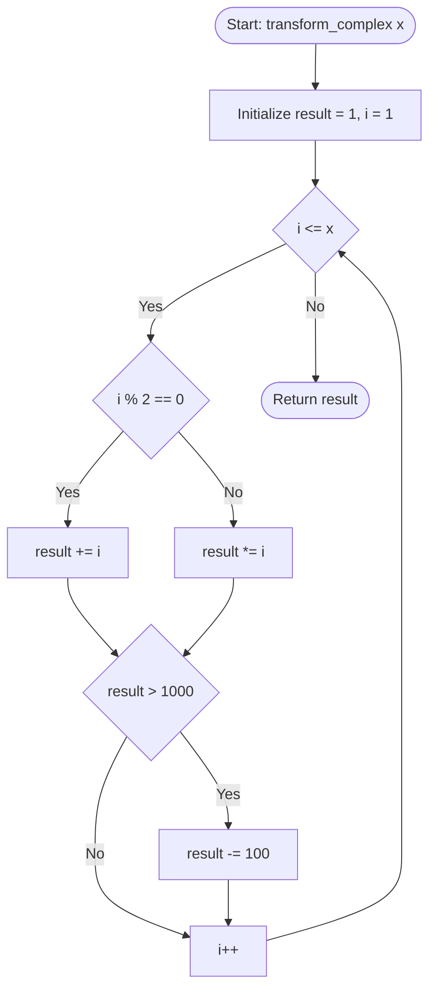

```mermaid
graph TD
  A([Start: transform_complex x]) --> B[Initialize result = 1, i = 1]
  B --> C{i <= x}
  C -- Yes --> D{i % 2 == 0}
  C -- No --> I([Return result])
  D -- Yes --> E[result += i]
  D -- No --> F[result *= i]
  E --> G{result > 1000}
  F --> G
  G -- Yes --> H[result -= 100]
  G -- No --> J[i++]
  H --> J
  J --> C
```
